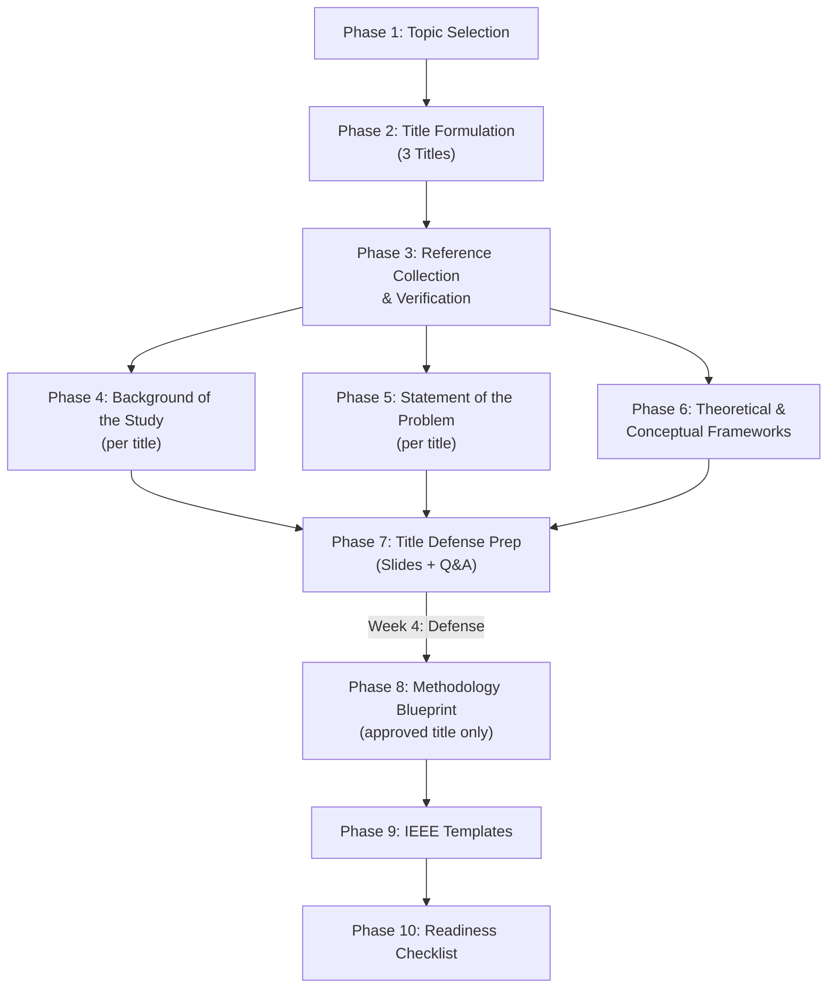

# CS Thesis Writing 1 — Full Preparation Plan (Expanded)

**Group Members:** Rogie P. Bacanto & Daniela S. Ungab | **Program:** BSCS-4 | **School:** NDMC, Pigcawayan, Cotabato

---

## Overview

This is the **complete** preparation plan for CS Thesis Writing 1. It covers everything from topic selection to title defense preparation. The goal is to enter class fully prepared with **3 defensible thesis titles**, verified references, and draft materials for Chapters 1-2.

> [!IMPORTANT]
> **Reference Integrity Rule**: Every reference will be verified by actually visiting the source URL. No hallucinated papers. No 404 links. Each reference will include a working DOI or URL confirmed before inclusion.

### NDMC Timeline Alignment

| Week | NDMC Requirement | What We Prepare |
|---|---|---|
| **Weeks 1-3** | Research & Topic Selection | Phases 1-6 below (topics, titles, references, drafts) |
| **Week 4** | **Title Defense** | Phase 7 (defense slides, anticipated questions) |
| **Week 5+** | Proposal Writing (Ch 1-2) | Phases 8-10 (full Chapter 1 & 2 drafts) |

---

## Phase 1: Topic Selection
**Goal:** Identify 3 candidate BSCS research problems (one per title for defense).

### Steps
- [ ] Rogie & Daniela select 2-3 preferred BSCS domains from:
  - Computer Vision / Deep Learning (image classification, object detection)
  - Natural Language Processing (translation, sentiment analysis, chatbots)
  - Algorithmic Optimization (routing, scheduling, pathfinding algorithms)
  - Cybersecurity (intrusion detection, lightweight cryptography)
  - Educational Games (procedural generation, adaptive difficulty)
- [ ] For each selected domain, research **real, unsolved problems** relevant to the Philippines
- [ ] Evaluate feasibility: Can 2 students complete this in 1 semester? Is a dataset available?
- [ ] Produce a shortlist of 3 specific research problems with justification

### Deliverable
- `topic_candidates.md` — Each candidate problem with: the problem statement, CS algorithm/technique, NDMC Research Agenda alignment (1-6), SDG alignment, feasibility score

---

## Phase 2: Title Formulation (3 Titles for Defense)
**Goal:** Craft exactly **3 thesis titles** to defend at Week 4.

### Title Quality Criteria
- [ ] Contains the **algorithm or technique** name (e.g., "Convolutional Neural Network", "Random Forest", "A* Algorithm")
- [ ] States the **application domain** (e.g., "for Crop Disease Detection", "for Network Intrusion Detection")
- [ ] Sounds **research-oriented** (avoid: "Management System", "Online Portal", "Monitoring System")
- [ ] Concise — ideally 15-25 words
- [ ] Each title targets a **different** NDMC Research Agenda (to show breadth)

### Title Format Pattern
> **"[Method/Algorithm] for [Application/Problem]: [Approach/Context]"**
>
> Example: *"A Convolutional Neural Network Approach for Real-Time Detection and Classification of Rice Leaf Diseases in Cotabato, Philippines"*

### Deliverable
- `proposed_titles.md` — 3 final titles, each with:
  - The title itself
  - Research Agenda alignment
  - SDG alignment
  - Core algorithm/technique
  - 3-5 research questions (Statement of the Problem)
  - Brief rationale (why this problem matters)

---

## Phase 3: Reference Collection & Verification
**Goal:** Build a reference list of **15-25 verified papers per title** (total: ~45-75 references across all 3 titles).

> [!CAUTION]
> **Anti-Hallucination Protocol**: Every reference goes through verification before inclusion.

### Verification Pipeline
For each reference:
1. **Search** — Use Google Scholar, IEEE Xplore, ACM DL, arXiv, Semantic Scholar, ResearchGate
2. **Visit** — Open the actual URL/DOI and confirm it loads (no 404)
3. **Extract** — Pull real title, authors, year, journal/conference, DOI from the actual page
4. **Record** — Save in IEEE format with verified URL

### Reference Categories Per Title
| Category | Purpose | Target Count |
|---|---|---|
| **Algorithm/Technique papers** | Core CS method (e.g., CNN, LSTM, GA) | 5-8 |
| **Application domain papers** | Similar techniques applied to the same problem | 4-6 |
| **Philippine/local context papers** | Studies from the Philippines or ASEAN | 2-4 |
| **Methodology papers** | Research design, SDLC models, evaluation metrics | 2-3 |
| **Related systems** | Existing tools/apps solving the same problem | 2-4 |

### Deliverable
- `verified_references_title1.md`
- `verified_references_title2.md`
- `verified_references_title3.md`

Each entry includes: IEEE citation, verified URL/DOI, 1-2 sentence summary, status (✅ Confirmed | ⚠️ Paywall | ❌ Rejected)

---

## Phase 4: Background of the Study Draft (Per Title)
**Goal:** Write a 2-3 page Background of the Study for each of the 3 titles.

### Writing Structure (Global → National → Local)
- [ ] **Paragraphs 1-2 (Global):** The worldwide problem and the CS technique that addresses it, citing international studies
- [ ] **Paragraphs 3-4 (National):** The Philippine context — what has been done, what gaps remain
- [ ] **Paragraphs 5-6 (Local):** Cotabato / Midsayap / NDMC context — why this study matters here and now
- [ ] **Final Paragraph:** The research gap and what this study aims to contribute

### Formatting
- [ ] A4 paper size
- [ ] IEEE citations (numeric: [1], [2], [3])
- [ ] 2-3 pages (double-spaced)
- [ ] All citations present in the verified reference list

### Deliverable
- `background_draft_title1.md`
- `background_draft_title2.md`
- `background_draft_title3.md`

---

## Phase 5: Statement of the Problem (Per Title)
**Goal:** Formulate 3-5 research questions for each title.

> [!NOTE]
> The Statement of the Problem is what the panelists will scrutinize most during the title defense. Each question must be answerable through the proposed algorithm/system.

### Structure
For each title, prepare:
- [ ] **General Problem Statement** — One sentence stating the overall research problem
- [ ] **Specific Questions** (3-5), typically:
  1. What is the current state/baseline of the problem? (Assessment question)
  2. How will the proposed algorithm/system be designed and developed? (Design question)
  3. How effective is the proposed algorithm/system based on [metrics]? (Evaluation question)
  4. Is there a significant difference between the proposed approach and the existing approach? (Comparative question — this one leads to the hypothesis)
  5. What is the level of user acceptance of the developed system? (If applicable — usability testing)

### Deliverable
- Included in `proposed_titles.md` under each title

---

## Phase 6: Theoretical & Conceptual Framework Preparation
**Goal:** Identify the theoretical anchors and conceptual model for each title.

> [!NOTE]
> NDMC allows a **maximum of 2 theories**: 1 major theory and 1 minor/supporting theory.

### Common Theoretical Frameworks for BSCS Theses
| CS Domain | Major Theory | Minor/Supporting Theory |
|---|---|---|
| Computer Vision / AI | **Connectionism Theory** (neural network learning) | Technology Acceptance Model (TAM) |
| Machine Learning | **Computational Learning Theory** (PAC learning) | Information Processing Theory |
| NLP | **Statistical Learning Theory** | Distributional Semantics Theory |
| Cybersecurity | **Game Theory for Security** | Defense-in-Depth Theory |
| Algorithms/Optimization | **Computational Complexity Theory** | Graph Theory |
| Educational Games | **Constructivism** (Piaget/Vygotsky) | Flow Theory (Csikszentmihalyi) |

### Conceptual Framework
- [ ] Create an **IPO (Input-Process-Output) diagram** or a **research paradigm** showing:
  - **Input**: Data/dataset, user inputs
  - **Process**: The algorithm/model, training, testing
  - **Output**: Results, predictions, classifications

### Deliverable
- `theoretical_frameworks.md` — Theory selections and conceptual framework diagrams for each title

---

## Phase 7: Title Defense Preparation
**Goal:** Prepare everything needed for the Week 4 Title Defense.

### What Panelists Typically Ask
- [ ] Why did you choose this topic?
- [ ] What makes this a CS thesis and not an IT capstone?
- [ ] What algorithm will you use and why?
- [ ] What is your dataset? Where will you get it?
- [ ] How will you evaluate/measure the results?
- [ ] What are your research questions?
- [ ] How does this align with the NDMC Research Agenda?
- [ ] What SDGs does this support?
- [ ] Is this feasible for 2 students in one semester?
- [ ] What existing studies are related to yours?

### Materials to Prepare
- [ ] **Presentation slides** (PowerPoint) for all 3 titles
- [ ] **1-page summary per title** (for panelists to read)
- [ ] **Cheat sheet of anticipated Q&A** with prepared answers
- [ ] **Printed reference list** per title (shows you did real research)

### Deliverable
- `title_defense_qa.md` — Anticipated questions with scripted answers for each title
- Slide outline for defense presentation

---

## Phase 8: Methodology Blueprint (For Approved Title)
**Goal:** After the panel approves one title, outline Chapter 2.

### Steps
- [ ] **Research Design**: Identify the appropriate design (e.g., Experimental, Quasi-Experimental, Developmental)
- [ ] **Locale & Respondents**: Define where and who (e.g., NDMC students, farmers in Cotabato, etc.)
- [ ] **Sampling Technique**: Determine how respondents are selected (e.g., purposive, random, stratified)
- [ ] **System Architecture**: Design context diagram, use case diagram, architecture diagram
- [ ] **Algorithm Selection**: Detail the specific algorithm(s) and why they were chosen
- [ ] **Dataset Plan**: Identify if using public dataset (Kaggle, UCI, etc.) or self-collected data
- [ ] **Tech Stack**: Choose programming languages, frameworks, and tools
- [ ] **Evaluation Metrics**: Define how success is measured (accuracy, precision, recall, F1, etc.)
- [ ] **Statistical Tools**: Identify tools for data analysis (e.g., SPSS, Python scipy, t-test, ANOVA)
- [ ] **Instrument Validation**: Plan the 7-step process if creating a researcher-made questionnaire
- [ ] **Ethical Considerations**: Reference the Belmont Report (1978) — respect for persons, beneficence, justice

### Deliverable
- `methodology_blueprint.md` — Full Chapter 2 outline with all subsections drafted

---

## Phase 9: IEEE Formatting Templates
**Goal:** Prepare ready-to-use templates so formatting is never an issue.

### Templates to Create
- [ ] **IEEE Reference List template** — Pre-formatted examples for:
  - Journal article
  - Conference paper
  - Book/textbook
  - Website/online source
  - Thesis/dissertation
- [ ] **Chapter heading template** — Word document with correct margins, spacing, and heading styles
- [ ] **Table and Figure numbering guide** — Arabic numeral format (Table 2.1, Figure 1.1)

### Deliverable
- `ieee_reference_guide.md` — IEEE format examples and rules
- `formatting_template_guide.md` — Margin, spacing, and heading specifications ready for copy-paste

---

## Phase 10: Thesis Readiness Checklist
**Goal:** A final pre-submission checklist to ensure nothing is missed.

### Before Title Defense (Week 4)
- [ ] 3 titles formulated with algorithm names
- [ ] Each title aligned to NDMC Research Agenda (1-6)
- [ ] Each title aligned to at least 1 SDG
- [ ] 3-5 research questions per title
- [ ] At least 10 verified references per title
- [ ] Background of the Study draft (2-3 pages) per title
- [ ] Theoretical framework identified per title
- [ ] Conceptual framework (IPO diagram) sketched per title
- [ ] Defense slides prepared
- [ ] Anticipated Q&A prepared

### Before Proposal Submission (Week 5+)
- [ ] Approved title confirmed
- [ ] Full Chapter 1 drafted (all sections 1.1 to 1.9)
- [ ] Full Chapter 2 drafted (all sections 2.1 to 2.11)
- [ ] All references verified and formatted in IEEE
- [ ] Drillbit plagiarism check passed
- [ ] Grammarly check passed
- [ ] Correct A4 formatting with proper margins applied

---

## Execution Order

## Open Questions for Rogie & Daniela

> [!IMPORTANT]
> I still need your input on these before I start executing:

1. **Which 2-3 BSCS domains interest you both?** (Computer Vision, NLP, Algorithms, Cybersecurity, or Educational Games)
2. **When does Week 1 officially start?** (So I can calculate the Week 4 title defense date)
3. **Do you still have page 2 of the timeline?** (The schedule image was cut off — there may be more milestones)
4. **Does your teacher require a minimum number of references?** (I defaulted to 15-25 per title)
5. **What programming languages are you both comfortable with?** (Python, Java, C++, JavaScript, etc.)
